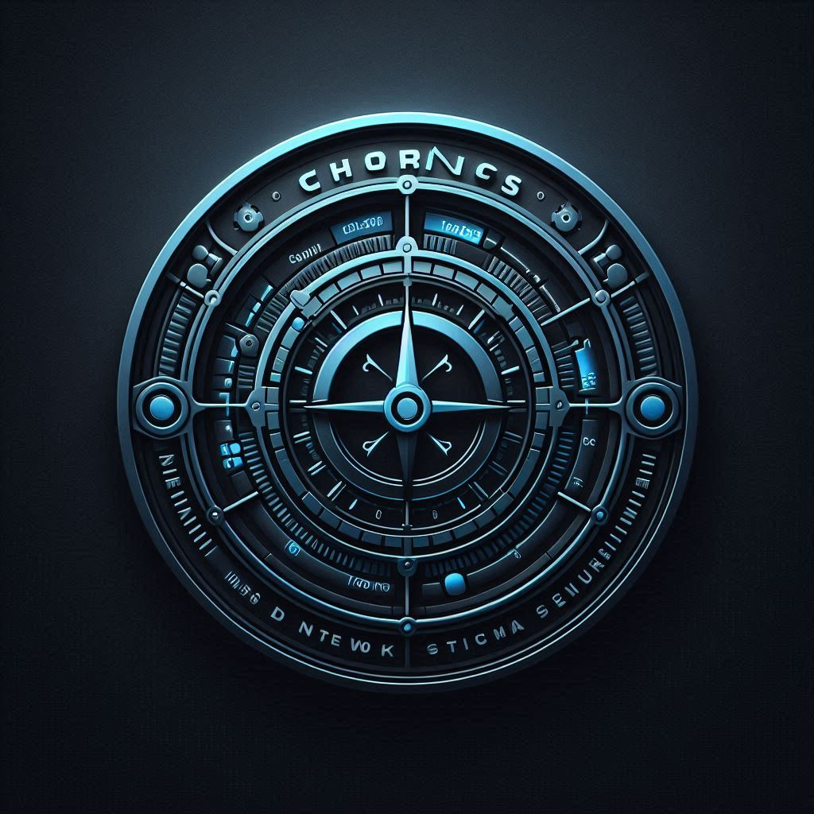
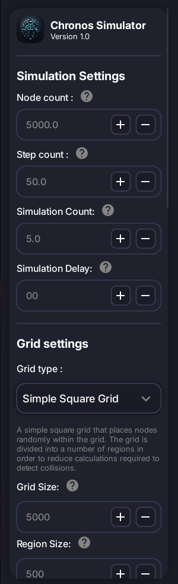
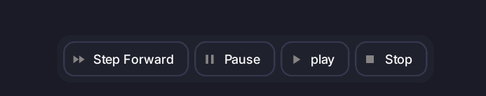
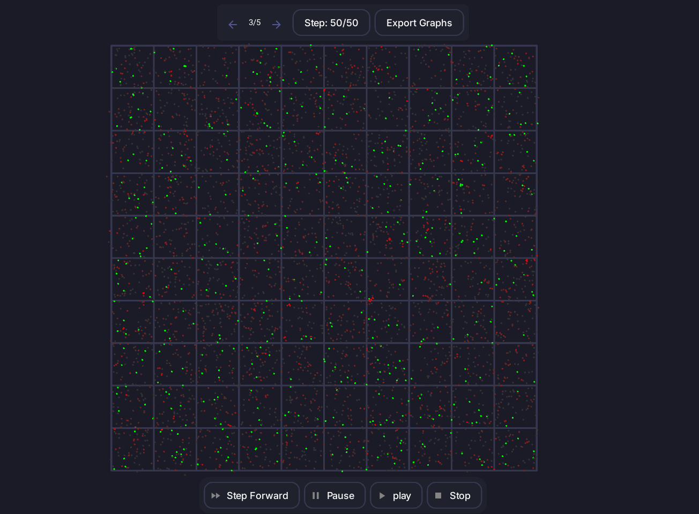

<!-- PROJECT SHIELDS -->
[![Contributors][contributors-shield]][contributors-url]
[![Forks][forks-shield]][forks-url]
[![Stargazers][stars-shield]][stars-url]
[![Issues][issues-shield]][issues-url]
[![Unlicense License][license-shield]][license-url]
[](https://wakatime.com/badge/user/47552522-5c3d-4509-a300-fbac59edf0f4/project/b395f9f3-18ea-4456-bc15-7cebddf6db8b)


<!-- PROJECT LOGO -->
<br />
<div align="center">
  <a href="https://github.com/Chronos-Network-Simulator/ChronosSim">
    
  </a>

  <h3 align="center">Chronos DTN Simulator</h3>

  <p align="center">
    A highly configurable, open-source, discrete-event simulator for Delay-Tolerant Networks (DTNs).
    <br />
    <a href="https://github.com/Chronos-Network-Simulator/ChronosSim"><strong>Explore the docs »</strong></a>
    <br />
    <br />
    <a href="https://github.com/Chronos-Network-Simulator/ChronosSim">View Demo</a>
    &middot;
    <a href="https://github.com/Chronos-Network-Simulator/ChronosSim/issues/new?labels=bug&template=bug-report---.md">Report Bug</a>
    &middot;
    <a href="https://github.com/Chronos-Network-Simulator/ChronosSim/issues/new?labels=enhancement&template=feature-request---.md">Request Feature</a>
  </p>
</div>


<!-- TABLE OF CONTENTS -->
<details>
  <summary>Table of Contents</summary>
  <ol>
    <li>
      <a href="#about-the-project">About The Project</a>
      <ul>
        <li><a href="#built-with">Built With</a></li>
      </ul>
    </li>
    <li>
      <a href="#getting-started">Getting Started</a>
    </li>
    <li><a href="#usage">Usage</a></li>
    <li><a href="#roadmap">Roadmap</a></li>
    <li><a href="#contributing">Contributing</a></li>
    <li><a href="#license">License</a></li>
    <li><a href="#contact">Contact</a></li>
  </ol>
</details>


<!-- ABOUT THE PROJECT -->
## About The Project

[![Product Name Screen Shot][product-screenshot]](https://example.com)

Chronos is an extremely configurable, discrete-event simulator for testing Delay Tolerant Network implementations.
Chronos is built with modular components that can be easy extended to support your own custom protocols and algorithms.
Almost all parts of the simulation loop can be customized to fit your needs simply by extending few base classes.Easily view
simulation results and restore from previos simulations along with the ability to step forward and step backward in time.
Chronos also generates detailed graphs about numerous metrics such as message delivery ratio, message latency, and more.

### Features

* **Highly Configurable**: Almost all parts of the simulation loop can be customized to fit your needs simply by extending few base classes.
* **Fully Compatible**: Chronos itself does not care about the underlying network protocol, allowing you to test any DTN protocol.
* **Easy to Use Interface**: Beautiful and intuitive user interface to configure simulation parameters.
* **Live Preview**: View simulation results in real-time with an efficient and optimized rendering system.
* **Custom Grids**: Easily create custom grids with different node spawning algorithms.
* **Custom Nodes**: Configure how you want each of your nodes to behave by simply implementing the `send_message` and `receive_message` methods.
* **Custom Message Types**: Easily create custom message types by extending the `Message` class allowing for you to test different payload sizes and types.
* **Extensive Graphs**: Generate detailed graphs about numerous metrics such as message delivery ratio, message latency, and more.
* **Simulation Restore**: Easily restore from previous simulations along with the ability to step forward and step backward in time.
* **Concurrent Simulation**: Run multiple simulations at once to generate less biased results. Chronos exports all individual simulation results as well as the combined results.
* **Multi-Processing**: Utilize all of your CPU cores to run simulations faster.
* **Multi-Platform**: Chronos is built with Kivy, allowing it to run on Windows, MacOS, and Linux.

### Built With

Chronos was built using the following technologies:

* [Python](https://www.python.org/)
* [Kivy](https://kivy.org/)
* [KivyMD](https://kivymd.readthedocs.io/en/latest/)

<p align="right">(<a href="#readme-top">back to top</a>)</p>


<!-- GETTING STARTED -->
## Getting Started

Run the following commands to get a local copy up and running.
```shell
git clone git@github.com:Chronos-Network-Simulator/ChronosSim.git
cd ChronosSim
pipenv install
pipenv run python main.py
```

<!-- USAGE EXAMPLES -->
## Usage

### Modules
Chronos is broken down into numerous modules. Each module contains a `BaseClass` that can be used to extend the functionality of that particular module in Chronos.
* **Grids**: Grids are used to spawn nodes in a specific pattern. You can create your own custom grids by extending the `BaseGrid` class.
* **Nodes**: Nodes are the entities that send and receive messages. You can create your own custom nodes by extending the `BaseNode` class.
* **Messages**: Messages are the data that nodes send and receive. You can create your own custom messages by extending the `BaseMessage` class.
* **Message Spawners**: Message spawners are used to spawn messages in the simulation. You can create your own custom message spawners by extending the `BaseMessageSpawner` class.
* **Target Spawners**: Target spawners are used to mark nodes as targets. You can create your own custom target spawners by extending the `BaseTargetSpawner` class.

Please refer to each specific BaseClass Docstrings for more information on each property and method.

### Simulation Settings

Chronos exposes certain settings of the simulation loop itself for your configuration. These are:
* **Node Count**: The number of nodes in the simulation. Future support will be added for Grids to be able to determin the number of nodes to be spawned and allow for dynamic node count.
* **Simulation Steps**: The number of steps the simulation will run for.
* **Simulation Count**: The number of simulations to run. This is useful for generating less biased results.
* **Simulation Delay**: The delay between each simulation step in seconds. Use this to get a better visual understanding of what is going on in the simulation.

### User Interface

Chronos splits the user interface into five major zones. Each zone is responsible for a different task and are logically separated.
* **Sidebar**:

  

  The sidebar will be your most used area. It contains the controls that allow you to configure the simulation and all its modules.
  When extending a base Module you can add your own custom properties with just one line and they will be automatically added to the sidebar.

* **Bottombar**:

  

  The bottombar contains the controls that allow you to interact with the simulation. You can start, pause, and stop the simulation from here. You can also step through the simulation one by one.

* **Topbar**:
  
  

  The topbar contains controls related to active simulations. You can view the current simulation step out of the total simulation steps. You can also switch between the differnet concurrent simulations to view their current status.
  The topbar also allowss you to export graphs and simulation results. [TEMPORARY]

* **GridView**:

  

  The gridview is where the simulation is rendered. Dark grey nodes are nodes that have almost no messages. Bright red nodes have the heightest number of messages. The color of the node is determined by the number of messages it has relative to the other nodes.
  Green nodes are target nodes.

* **StatusSideBar** (Coming Soon):

  The status sidebar will contain detailed information about the current simulation. This view will be configurable and will allow you to set what properties of your model you want to track and show here as a live preview.

<p align="right">(<a href="#readme-top">back to top</a>)</p>


<!-- ROADMAP -->
## Roadmap

- [ ] Add Support for more Graphs
- [ ] Add More Grid Types
- [ ] Add More Node Types
- [ ] Add More Message Types
- [ ] Add More Message Spawners
- [ ] Add More Target Spawners
- [ ] Add a proper Settings page with theme settings, output directory settings, graph settings, grid live view settings etc.
- [ ] Allow for node count to be handled by the grid rather than the simulation itself
- [ ] Implement the StatusSideBar

See the [open issues](https://github.com/Chronos-Network-Simulator/ChronosSim/issues) for a full list of proposed features (and known issues).

<p align="right">(<a href="#readme-top">back to top</a>)</p>


<!-- CONTRIBUTING -->
## Contributing

Contributions are what make the open source community such an amazing place to learn, inspire, and create. Any contributions you make are **greatly appreciated**.

If you have a suggestion that would make this better, please fork the repo and create a pull request. You can also simply open an issue with the tag "enhancement".
Don't forget to give the project a star! Thanks again!

1. Fork the Project
2. Create your Feature Branch (`git checkout -b feature/AmazingFeature`)
3. Commit your Changes (`git commit -m 'Add some AmazingFeature'`)
4. Push to the Branch (`git push origin feature/AmazingFeature`)
5. Open a Pull Request

> **Note**:  This Project was created for a University Thesis. Not all features will be able to be merged due to plagiarism concerns. Please keep this in mind when contributing.

### Top contributors:

<a href="https://github.com/Chronos-Network-Simulator/ChronosSim/graphs/contributors">
  
</a>


<p align="right">(<a href="#readme-top">back to top</a>)</p>


<!-- LICENSE -->
## License

Distributed under the MIT License. See `LICENSE.txt` for more information.

<p align="right">(<a href="#readme-top">back to top</a>)</p>


<!-- CONTACT -->
## Contact

Guhan SenSam - [@GSenSam](https://twitter.com/your_username) - guhansensam@gmail.com

Developer Website: [https://guhansensam.com](https://guhansensam.com)

Project Link: [https://github.com/Chronos-Network-Simulator/ChronosSim](https://github.com/Chronos-Network-Simulator/ChronosSim)

<p align="right">(<a href="#readme-top">back to top</a>)</p>


<!-- MARKDOWN LINKS & IMAGES -->
<!-- https://www.markdownguide.org/basic-syntax/#reference-style-links -->
[contributors-shield]: https://img.shields.io/github/contributors/Chronos-Network-Simulator/ChronosSim.svg?style=for-the-badge
[contributors-url]: https://github.com/Chronos-Network-Simulator/ChronosSim/graphs/contributors
[forks-shield]: https://img.shields.io/github/forks/Chronos-Network-Simulator/ChronosSim.svg?style=for-the-badge
[forks-url]: https://github.com/Chronos-Network-Simulator/ChronosSim/network/members
[stars-shield]: https://img.shields.io/github/stars/Chronos-Network-Simulator/ChronosSim.svg?style=for-the-badge
[stars-url]: https://github.com/Chronos-Network-Simulator/ChronosSim/stargazers
[issues-shield]: https://img.shields.io/github/issues/Chronos-Network-Simulator/ChronosSim.svg?style=for-the-badge
[issues-url]: https://github.com/Chronos-Network-Simulator/ChronosSim/issues
[license-shield]: https://img.shields.io/github/license/Chronos-Network-Simulator/ChronosSim.svg?style=for-the-badge
[license-url]: https://github.com/Chronos-Network-Simulator/ChronosSim/blob/master/LICENSE.txt
[product-screenshot]: images/main.png
